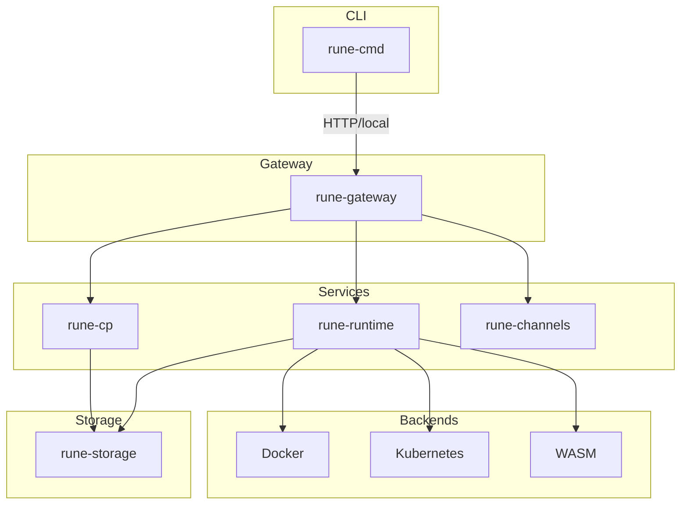

# Rune — Architecture Overview

Rune is a production-grade **AI agent runtime** written in Rust. It handles the full lifecycle of AI agents: packaging, deploying, scheduling, executing, and networking them — across Docker, Kubernetes, and WASM backends.

## High-Level Overview



**Component roles:**

- **rune-cmd** — CLI: `agent ls/inspect/sessions/stop/rm`, `run`, `daemon start/stop/status`, `compose up/down/ps`, `cluster`, `debug`
- **rune-gateway** — REST API, A2A JSON-RPC, channels webhook, rate-limit, JWT auth, Prometheus `/metrics`
- **rune-cp** — Control plane: deployment admission, registry, rollout
- **rune-runtime** — Execution engine: planner, tool dispatch, session management
- **rune-channels** — Messaging adapters (Slack, Telegram, etc.)
- **rune-storage** — SQLite + Raft consensus + object store

## Crate Map

| Crate | Role |
|-------|------|
| `rune-spec` | YAML schemas: `Runefile`, `workflow.yaml`, `tools/*.yaml`, `rune-compose.yml` |
| `rune-store-runtime` | `RuntimeStore` trait — lightweight abstraction for runtime-generated data (sessions, requests, A2A tasks, tool invocations) |
| `rune-a2a` | Agent-to-Agent protocol client (Google A2A spec over JSON-RPC) |
| `rune-storage` | `RuntimeStore` implementation — SQLite + Raft consensus + object store |
| `rune-network` | Network policy and peer endpoint registry |
| `rune-runtime` | Execution engine: LLM clients, tool dispatch, session management, scheduler |
| `rune-cp` | Control-plane HTTP server: deployment admission, registry, rollout |
| `rune-gateway` | External-facing HTTP gateway: invoke, sessions, A2A, channels, canvas |
| `rune-channels` | Messaging channel adapters (40+ platforms) |
| `rune-tools` | Built-in tool implementations (`rune@*`) |
| `rune-backend/rune-docker` | Docker container backend |
| `rune-backend/rune-k8s` | Kubernetes backend |
| `rune-backend/rune-wasm` | WASM (Wasmtime) backend |
| `rune-env` | Platform environment config (loaded from env vars) |
| `rune-cmd` | CLI binary — all user-facing commands |

## Agent Package Layout

An agent is a directory with a `Runefile` and optional extras:

```
my-agent/
├── Runefile        # required — identity, runtime config, model config
├── workflow.yaml   # optional — DAG of agent steps
└── tools/
    ├── search.yaml     # tool descriptor
    └── search.py       # or .js, .wasm, Dockerfile
```

`rune-spec::AgentPackage::load()` reads the `Runefile` and auto-injects built-in `rune@*` tool descriptors for any tool names starting with `rune@`.

## Storage Layer (`rune-storage`)

`RuneStore` is the single storage abstraction used everywhere.

### Two Modes

**Standalone** — All reads and writes go directly to a local SQLite database. Default for single-node deployments.

**Cluster** — Writes are proposed through **OpenRaft** consensus and applied to every node's SQLite once committed. Reads go directly to local SQLite (eventually consistent within Raft commit latency).

### What's Stored

- **Deployments** — desired replica count, active/inactive state
- **Replicas** — backend instance ID, state (pending/ready/draining/failed), load counter, heartbeat timestamp
- **Sessions** — message history, checkpoint, assigned replica
- **Requests** — input payload, output, status
- **Tool invocations** — per-tool audit trail
- **Agent calls** — A2A call graph (caller, callee, depth, latency)
- **A2A tasks** — task state machine (working/completed/cancelled/failed)
- **Cache** — session-to-replica routing with TTL, rate-limit counters
- **Registry** — registered agent versions with OCI image reference
- **Network** — per-agent network memberships and direct replica endpoints
- **Schedules** — cron-based and interval-based schedule records
- **Policy audit** — allowed/denied policy decisions

## Execution Engine (`rune-runtime`)

### Request Lifecycle

1. **Gateway** receives `POST /v1/agents/:name/invoke`
2. **ReplicaRouter** resolves deployment → picks least-loaded healthy replica
3. **SessionManager** creates or restores a session (message history from SQLite)
4. **Planner** runs the LLM loop:
   - Sends messages to the LLM (Anthropic, OpenAI, Gemini, Copilot, or ClaudeCode)
   - Receives streamed `ContentBlock`s
   - When the model calls a tool → **ToolDispatcher** runs it
   - Appends assistant + tool result messages to session
   - Repeats until `stop` or `max_steps` reached
5. Result is streamed back via SSE or returned as JSON

### Components

| Component | Description |
|-----------|-------------|
| `LlmClient` | Unified LLM wrapper: `AnthropicClient`, `OpenAiClient`, `GeminiClient`, `CopilotClient`, `ClaudeCodeClient` |
| `Planner` | Orchestrates the LLM turn loop; emits `SseEvent` stream |
| `ToolDispatcher` | Routes tool calls to built-in (`rune@*`), WASM, or process runners |
| `WasmToolRunner` | Executes WASM tool modules via Wasmtime |
| `SessionManager` | Loads, appends to, and checkpoints session message history |
| `WorkflowExecutor` | Executes a DAG of agent steps in topological-wave parallel order |
| `PolicyEngine` | Evaluates allow/deny rules before tool calls |
| `ReconcileLoop` | Continuously reconciles desired vs actual replica counts |
| `ReplicaRouter` | Lease-based sticky session routing to healthy replicas |
| `SqliteCache` | Session route cache with TTL; also provides rate-limit primitives |

## Gateway Middleware Stack

(outermost → innermost)

1. `TraceLayer` — OpenTelemetry distributed tracing
2. `auth` — JWT validation (via `jsonwebtoken`)
3. `rate_limit` — token-bucket rate limiter

## Observability

- **Structured logging** — `tracing` + `tracing-subscriber` (JSON or pretty format, `RUST_LOG` env filter)
- **Distributed tracing** — OpenTelemetry OTLP export via gRPC (`OTEL_ENDPOINT` env var)
- **Metrics** — `metrics` + `metrics-exporter-prometheus`, exposed at `GET /metrics`
- **Audit log** — every policy decision is written to `rune-storage` with kind, resource, allowed/denied, reason, and request ID

## Deployment Modes

| Mode | Description |
|------|-------------|
| **Single-node** | `rune daemon start` — `StoreMode::Standalone`, no Raft overhead |
| **Cluster** | 3+ nodes, each running the daemon; Raft elected leader handles all writes; followers serve reads |
| **Embedded** | Gateway + runtime linked into the same process (default daemon config) |
| **Split** | Control plane (`rune-cp`) and gateway (`rune-gateway`) deployed separately |
